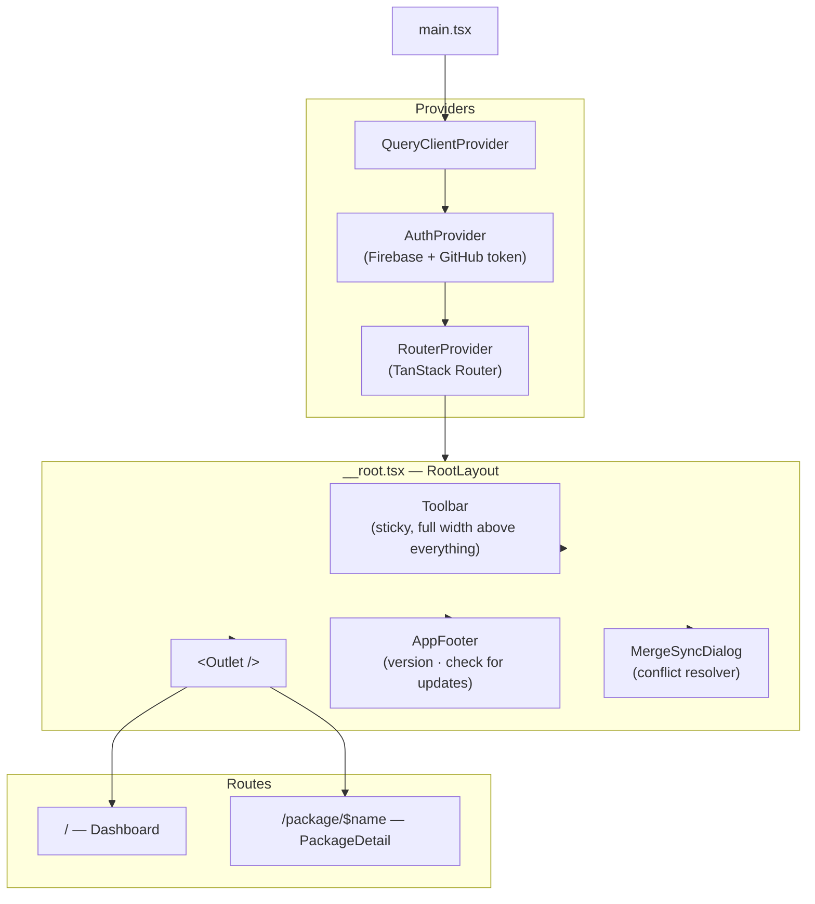
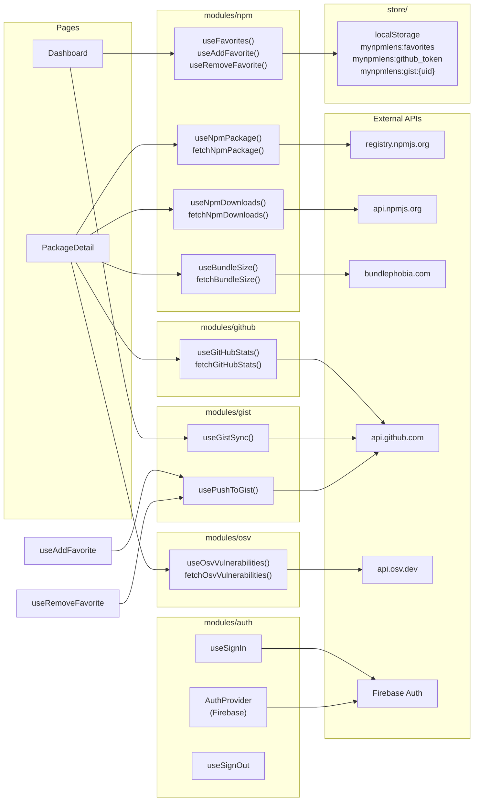
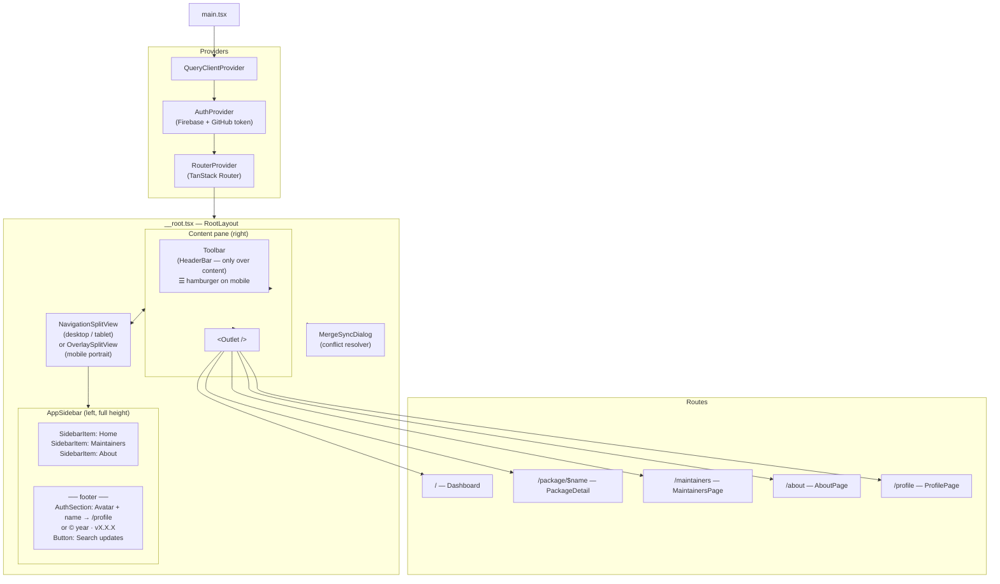
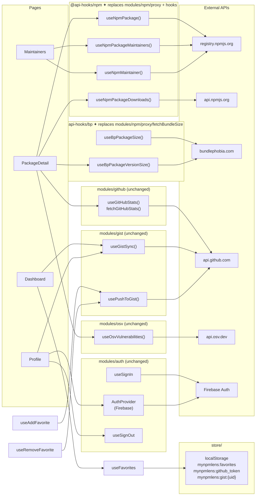

# Architecture

## Current

### Render tree

---

### Data layer

---

---

## New version

### Render tree

---

### Data layer

---

### What changes

| Área | Actual | Nuevo |
| --- | --- | --- |
| Layout | `Toolbar` arriba de todo + `AppFooter` abajo | `NavigationSplitView`: sidebar izquierdo + `Toolbar` solo sobre el contenido |
| Mobile | Sin sidebar | `OverlaySplitView` con botón ☰ |
| Navegación | Solo back/home en `Toolbar` | `SidebarItem` por ruta: Home · Maintainers · About |
| User info | `AuthSection` en `Dashboard` | Footer del sidebar → navega a `/profile` |
| Version / updates | `AppFooter` | Footer del sidebar |
| Rutas nuevas | — | `/maintainers`, `/about`, `/profile` |
| npm proxy/hooks | `fetchNpmPackage`, `fetchNpmDownloads`, `useNpmPackage`, `useNpmDownloads` | `@api-hooks/npm` |
| Bundlephobia proxy/hook | `fetchBundleSize`, `useBundleSize` | `@api-hooks/bp` |
| Bundle size en detail | Siempre latest | `useBpPackageVersionSize` — versión seleccionada |
